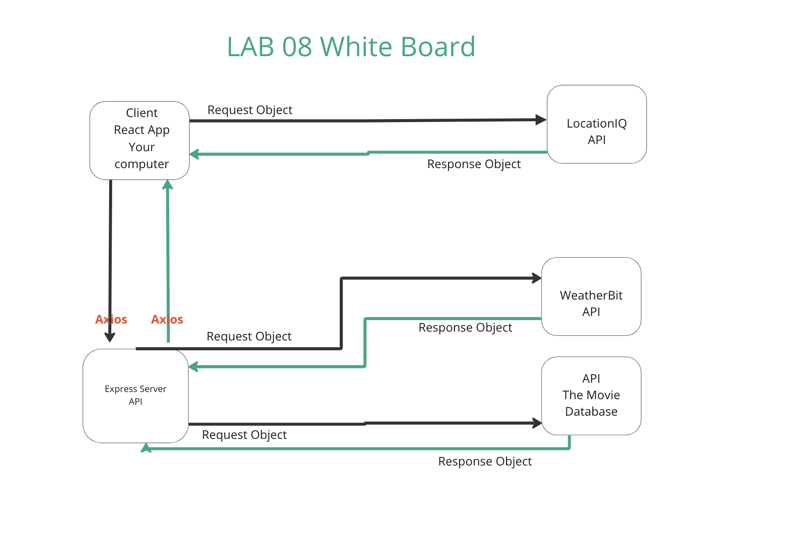

# City Explorer API

**Author**: Ezgi Coban
**Version**: 1.0.0 (increment the patch/fix version number if you make more commits past your first submission)

## Overview
<!-- Provide a high level overview of what this application is and why you are building it, beyond the fact that it's an assignment for this class. (i.e. What's your problem domain?) -->

## Getting Started
<!-- What are the steps that a user must take in order to build this app on their own machine and get it running? -->

## Architecture
<!-- Provide a detailed description of the application design. What technologies (languages, libraries, etc) you're using, and any other relevant design information. -->

## Change Log
<!-- Use this area to document the iterative changes made to your application as each feature is successfully implemented. Use time stamps. Here's an example:

01-01-2001 4:59pm - Application now has a fully-functional express server, with a GET route for the location resource. -->

## Credit and Collaborations
<!-- Give credit (and a link) to other people or resources that helped you build this application. -->
Created WRRC whiteboard for lab 08 with Manuch.

## Lab 08 White Board

Time Estimates
For each of the lab features, make an estimate of the time it will take you to complete the feature, and record your start and finish times for that feature:

Name of feature: Weather

Estimate of time needed to complete: 2 hrs

Start time: 4:20 pm

Finish time: 9pm

Actual time needed to complete: ~ 5 hrs

---------------------------

Name of feature: Errors

Estimate of time needed to complete: 1 hour

Start time: 5pm

Finish time: 5:30pm

Actual time needed to complete: 30 mins

---------------------------

Name of feature: Weather (live)

Estimate of time needed to complete: 2 hours

Start time: 6:40pm , 3:35

Finish time: 10:30pm, 5:10

Actual time needed to complete: 5.5 hrs

---------------------------

Name of feature: Movies

Estimate of time needed to complete: 4 hours

Start time: 

Finish time: 

Actual time needed to complete: 
